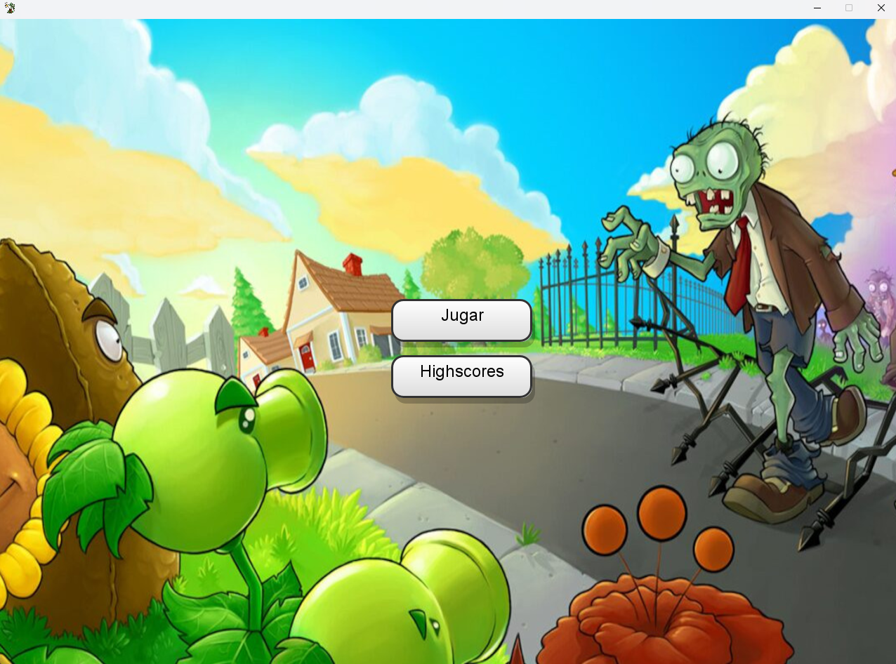
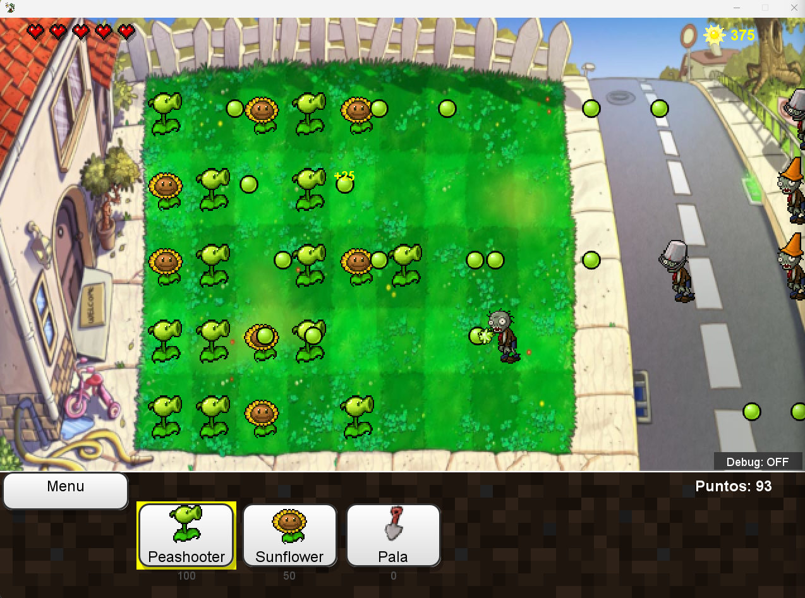
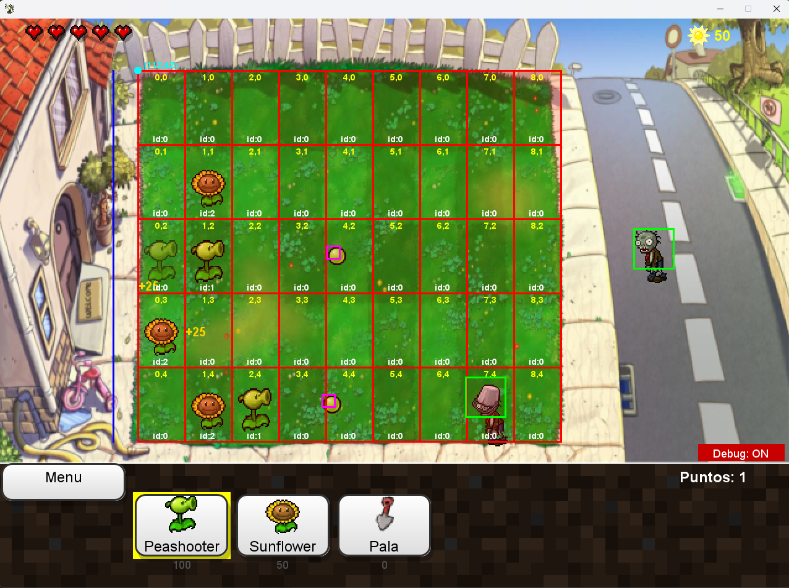

## Proyecto Final Programación 3

---

### Integrantes:

- Catelani, Lucio
- Máspero, Tomás

---

Clon del clásico juego "Plantas vs Zombies" realizado en Java utilizando las librerías gráficas de Swing y conexión a base de datos mediante JDBC. 

### Features:

- Jugabilidad continua con dificultad incremental a medida que el jugador va adquiriendo puntos
- Lectura de tipos de plantas y enemigos desde la DB
- Armado dinámico de botones según los datos leídos de la DB de las plantas jugables
- Sistema de colisiones entre proyectiles y enemigos
- Sistema de spawneo automático y randomizado de enemigos
- Guardado de estadísticas de puntaje por partidas
- Registro de jugadores al finalizar la partida en metodología "arcade" (se ingresan 3 letras para identificar a un jugador, si no existe en la DB, se crea)

### Modo debug:

Muestra la grilla en detalle, la línea de límite a la que tienen que llegar los enemigos (en azul) y las colisiones de los proyectiles y enemigos

